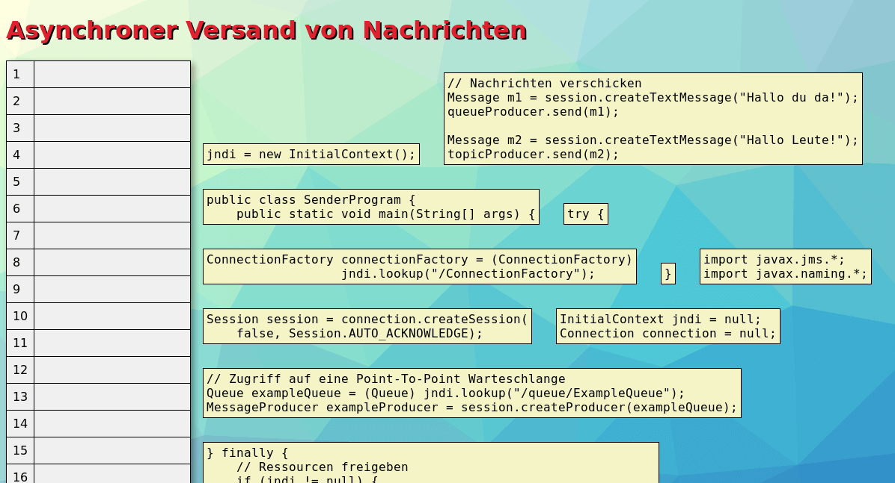
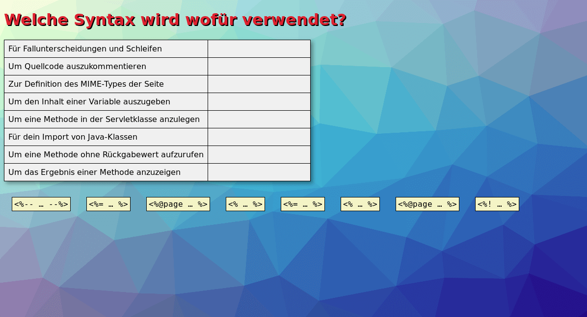
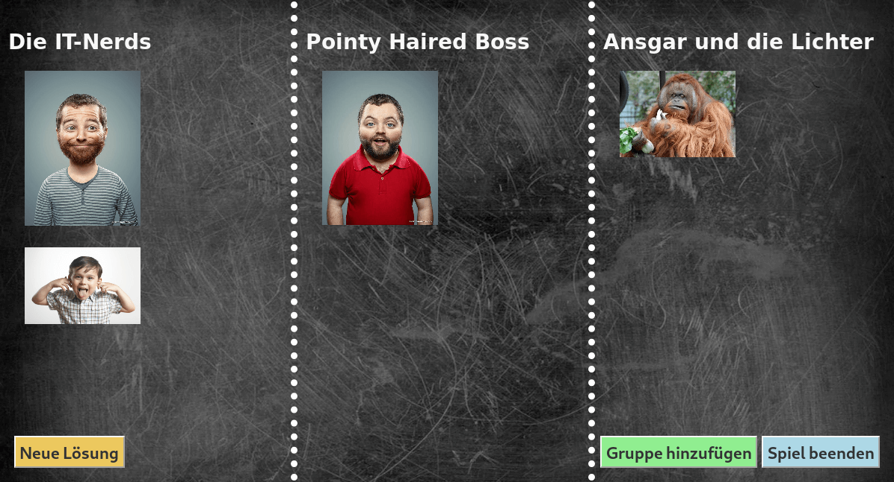

Learning Apps
=============

Kurzbeschreibung
----------------

Dieses Repository enthält eine Sammlung kleinerer Learning Apps, die zur
Auflockerung einer Vorlesung unter Anleitung der Lehrperson gemeinsam bearbeitet
werden können. Auf diese Weise soll den Vorlesungen ein spielerischer Touch
gegeben werden, ohne dabei vom Inhalt abzulenken. Die hier enthaltenen Apps
sind alle ganz simple HTML/JavaScript-Programme, die relativ einfach an eigene
Inhalte anpassbar sind.

<table style="max-width: 100%;">
    <tr>
        <td>
            
        </td>
        <td>
            
        </td>
        <td>
            
        </td>
    </tr>
    <tr>
        <td>
            Quellcode-Puzzle zu JMS und JNDI
        </td>
        <td>
            Quellcode-Puzzle zu JSP
        </td>
        <td>
            Ergebnissicherung für Wettbewerbsgruppen
        </td>
    </tr>
</table>

Copyright
---------

Der gesamte Quellcode ist lizenziert unter
[_CC0 1.0 Universell (CC0 1.0)_](https://creativecommons.org/publicdomain/zero/1.0/deed.de)

© 2015 Dennis Schulmeister-Zimolong

E-Mail: [dhbw@windows3.de](mailto:dhbw@windows3.de)  
Website: https://www.wpvs.de/#/lernkontrollen
